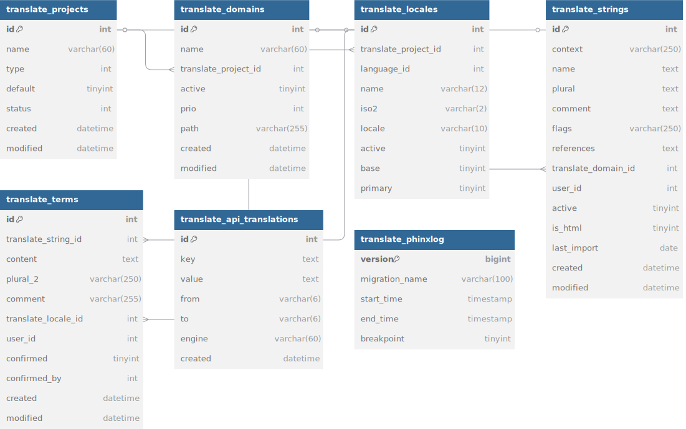

# CakePHP Translate Plugin

## Translation Strategies
There are two main strategies.

### Repository based
- Extract into POT files
- Import into Translate plugin
- Translate locally via web backend
- Export into PO files
- Commit and deploy repository

The advantage here is a clear diff of the PO file showing the changes to double-check.
It also works great with different branches and deployment as the translations always fit to the current code base.

This is currently the implemented default.

### DB based
- Import from any source.
- Extract right into DB instead of the POT file detour.
- Manage translations on the live server.
- Directly read translations from the DB.

This is great for team based translating.
The problem is, however, that upon deployment this would not have translations first, until actually translated afterwards,
or you would need to import from a different source that pre-translated.

So if you want to workaround this, you could set up a staging server, that serves as main translation base.
Here you extract, translate and export into a (free) translation online storage, or translation tool like [weblate](https://docs.weblate.org/en/latest/about.html).
The live server would then pull those new translations right on deployment.

## General table overview

The structure of the plugin is as follows:



- By default, you only need one project.
- You can import the strings per language and domain.
- Those get translated in the terms.

The api_translations table holds any engine related imports.
So on update you know what changed.


## Important database config
Use `'quoteIdentifiers' => true` for your Datasources config.

The TranslateStrings DB fields `context` and `name` must be case-sensitive, all other fields should not be.
This is important when dealing with the same string in different casings, as otherwise one of those would be translated, all others would (silently) not.

When using MySQL that means those two should be `utf8_bin`, whereas the rest should become `utf8mb4_unicode_ci` as per migration file and the right table collation defaults.

When using Postgres, make sure the CI extension is installed (as here everything is by default case sensitive) and make all non CS fields CI with it.

## Configuration
Adjust your app.php and add Translate configuration:
```php
'Translate' => [
    'noComments' => true, // Do not output references, tags, ... into PO files
    'plurals' => 2, // 2 is the default for most languages, 6 is the max
    'engine' => MyCustomEngine::class,
],
```

It is recommended to not output the references into the PO files for easier diffing.
They usually are already in the POT files anyway - and then inside Translate, as well.

If you need to use more than 2 plurals (for some languages), make sure you extend the database table, as well.
Add `plural_3` up to `plural_6` if needed to the "translation_terms".


## Extract right into DB instead of the POT file detour.

TODO

## Directly read translations from the DB.
Configure I18n to use the Translate MessagesDbLoader for default domain:

```php
I18n::config('default', function ($domain, $locale) {
    return new MessagesDbLoader(
        $domain,
        $locale
    );
});
```
If you have more than just default domain, you will need to do this for each domain separately.

## Translation Auto-Suggest

By default it uses a simple Google API translation.
This has a few limitations, however.

You can use any [other translation service](https://www.programmableweb.com/news/63-translation-apis-bing-google-translate-and-google-ajax-language/2013/01/15) by just switching out the `'engine'` config.
Provide a class name to an engine that extends the `Translate\Translator\EngineInterface`.

You can provide an array if you want to leverage multiple engines at once.
For auto-translating it would take the first engine result it finds, for suggest it will ask all engines for a suggestion and provide all results in the view to pick.

All API translations will be internally cached, so a 2nd lookup for the same translation will always read from this cache table.
This saves a lot expensive API calls (many translations services charge per lookup).

See [Translator Engines](TranslatorEngines.md) for plugin implemented ones to chose from.

### Add your own implementation
Create a class in your project as `src/Translator/Engine/MyClassName.php`:
```php
namespace App\Translator\Engine;

use Translate\Translator\EngineInterface;

class MyClassName implements EngineInterface {

    /**
     * @param string $text Text
     * @param string $to Iso2 code (e.g.: de)
     * @param string $from Iso2 code (e.g.: en)
     *
     * @return string|null
     */
    public function translate($text, $to, $from) {
        ...

        return $result;
    }

}
```
It should not throw exceptions, instead use try/catch if needed and log the message away, for example.


## Layout adjustments
The default layout is based on Twitter Bootstrap v3.
It uses fontawesome for the action buttons. Please make sure you include this CSS library, if you are using the default templates.

You can customize templates by moving them into the right folder in project level.
See [CakePHP docs](https://book.cakephp.org/3.0/en/plugins.html#overriding-plugin-templates-from-inside-your-application).

## Translating
See [Translating](Translating.md).

## Helping out
Your help is greatly appreciated. Only with more developers from different language backgrounds can this plugin become more sophisticated.

See [Contributing](Contributing.md).
